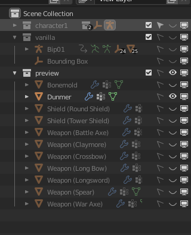
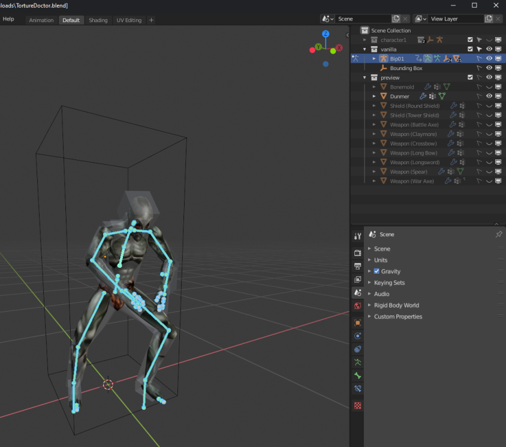
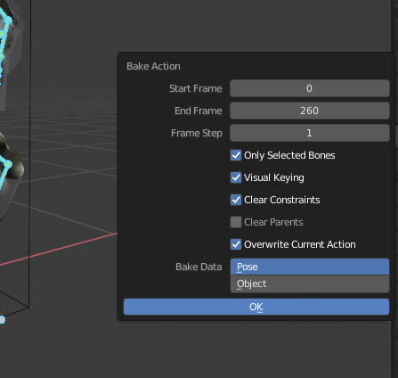

# Animation

## Requirements

- Requires Morrowind & Construction Set
- Requires [NifSkope 1.2.0](http://niftools.sourceforge.net/wiki/NifSkope)
- Requires [Blender 2.91](https://www.blender.org) (or compatible version)
- Requires Greatness7's [Morrowind Blender Plugin](https://blender-morrowind.readthedocs.io/en/latest/index.html)
- Requires Greatness7's Rig Tools Plugin (in repository)
- Requires Greatness7's `Rig.blend` starting file (in repository)

This guide assumes a basic working knowledge of these tools.

## Creating an NPC Animation

1. Open `Rig.blend` in Blender. This file provides a pre-configured rigging for easily making animation, which can then be exported for use in Morrowind.
2. After opening the blend file, you should see a dunmer with "widgets" surrounding his body.


3. Blender will often start you in `Object mode`. Click on any of the widgets and then switch to `Pose mode`.
4. In `Pose mode`, attempt to rotate or move some of the boxes. You should see the changes reflecting in the position of the dunmer.

> The main benefit of this rig is that it can toggle between inverse kinematics and forward kinematics. FK mode is the one it's on by default, where bones are a heirarcy of parent:child and when you move a parent it will move the whole children chain.

5. To toggle to IK (inverse kinematics) mode, press `[N]` to open the window side panel, then go to `Tools->Rig Main Properties`.

> If you do not have `Rig Main Properties`, make sure the `Rig Tools` plugin is enabled.


6. Then, select one of the hand or feet widgets and press the button `Snap IK-FK` to enable IK. Attempt to move or rotate the widget again to understand the difference in behaviour. Clicking the button again will return to FK.

7. Change the position as desired, then press `[A]` to select all widgets. Press `[I]` to create a keyframe. Select `Location + Rotation`. This will generate a keyframe in the graph editor.

> If you don't see the graph editor, try switching to the Animation environment in Blender.

> Make sure to select all widgets when creating a key frame, or you'll lose that part of your animation.

8. You can manually move the current frame in the graph editor to another frame, change the positioning, and then create a new keyframe at that frame. Press `[Space]` to play the animation between your two key frames. Repeat this as many times as needed to create your animation.


9. Press `[CTRL] + [TAB]` to toggle between the animation timeline / graph in the graph editor.

10. Save your blend file as a new file, such as `ExampleAnimation.blend`

## Exporting an NPC Animation

Once you are satisfied with the animation, it must be converted to a Morrowind-friendly format and exported.

1. Exporting the animation requires making permanent changes to the blend file. Save your blend file as a new one, such as `ExampleAnimation_Baked.blend`.

2. To export the animation, we have to bake the current animations. Currently, the animations created only animate the widgets, which Morrowind does not understand. So, we have to bake all of the bones real positions into keyframes, which Morrowind can understand. First, we have to modify the scene collection. `[SHIFT] + [CLICK]` the "eye" next to `character1` in the Scene Collection window to hide the widgets from view.



3. Then, `[SHIFT] + [CLICK]` the "eye" and "pointer" next to `vanilla` to show the vanilla bones and make them selectable.

> To hide the dummer, click the eye next to `Dunmer` in the `preview` area of the Scene Collection.

4. Select a vanilla bone in the Object window, then enter `Pose mode`. Press `[A]` to select all bones. You _MUST_ select all bones or the next step will not work!



5. Press `[F3]` to open the command search. Search for `Bake Action...` and click it. In the `Bake Action` window, enable all checkbox options except for `Clear Parents`. Press `Ok`.



6. The graph editor should now contain a lot of yellow dots, representing the baked animation data. Try to play the animation. It should play as normal.

7. If you have not hidden the dunmer yet, do so now. `[SHIFT + CLICK]` the "eye" next to the dunmer in the Scene Collection.

8. If needed, we must setup keyframe text data so Morrowind knows what to do with each part of the animation. You can find a full list of text keys in the section `Animation Text Keys`. To do this, click in the graph editor panel and press `[N]` to open the side menu. From there, you can add text entries for each set of frames in your animation. For general animations, `Idle9` is the standard text key.


> If pressing `[N]` in the graph editor does not open the Morrowind sidebar, you probably have not baked your animations yet.

> A full list of text keys can be found in the section, `Animation Text Keys`, as well as more information about entering text keys.

9. Export the animation. Go to `File -> Export -> Morrowind`. Enable options `Export Animation` and `Extract Keyframe data`. The export will generate 3 files. All 3 are required by Morrowind.

### Usage Notes:

- The animation files can be previewed in NifSkope by opening the export file which _does not_ start with `x`. NifSkope should automatically play the animation track.
- The animation files can be used in the CS by assignined the export file which _does not_ start with `x` to an NPC, and then setting their AI appropriately if needed. If you used `idle9` as the text key, set that field to 100% chance in the AI window of the CS for it to run in a loop.

## Animation Text Keys

Text keys are used by Morrowind to know when to play a given animation.

Available Animation Text Keys:

```
0.000000 | Idle: Start
2.666667 | Idle: Stop
2.733333 | Idle2: Start
4.533333 | Idle2: Loop Start
16.866667 | Idle2: Loop Stop
17.733334 | Idle2: Stop
29.733334 | Idle3: Start
35.066666 | Idle3: Stop
35.400002 | Idle4: Start
40.733334 | Idle4: Stop
41.066669 | Idle5: Start
46.400002 | Idle5: Stop
46.466667 | Idle6: Start
65.133331 | Idle6: Stop
65.400002 | Idle7: Start
66.066666 | Idle7: Loop Start
68.733337 | Idle7: Loop Stop
70.733337 | Idle7: Stop
71.066666 | Idle8: Start
72.400002 | Idle8: Loop Start
74.400002 | Idle8: Loop Stop
76.400002 | Idle8: Stop
76.466667 | Idle9: Start
83.133339 | Idle9: Stop
83.400002 | Idlehh: Start
86.066666 | Idlehh: Stop
86.400002 | Idle1h: Start
89.066666 | Idle1h: Stop
89.400002 | Idle2c: Start
92.066666 | Idle2c: Stop
92.400002 | Idle2w: Start
95.066666 | Idle2w: Stop
95.133339 | IdleSwim: Start
97.133339 | IdleSwim: Stop
97.200005 | Torch: Start
99.866669 | Torch: Stop
100.000000 | Hit1: Start
100.333336 | SoundGen: Moan
101.000000 | Hit1: Stop
101.066666 | Hit2: Start
101.466667 | SoundGen: Roar
102.200005 | Hit2: Stop
102.266670 | Hit3: Start
102.666672 | SoundGen: Scream
103.266670 | Hit3: Stop
103.333336 | Hit4: Start
104.333336 | Hit4: Stop
104.400002 | Hit5: Start
104.800003 | SoundGen: Roar
105.400002 | Hit5: Stop
105.466667 | Death1: Start
107.133339 | Death1: Stop
107.200005 | Death2: Start
108.600006 | Death2: Stop
108.666672 | Death3: Start
109.133339 | SoundGen: Moan
110.866669 | Death3: Stop
110.933334 | Death4: Start
111.133339 | SoundGen: Scream
112.600006 | Death4: Stop
112.666672 | Death5: Start
113.000000 | SoundGen: Roar
114.200005 | Death5: Stop
114.333336 | Knockdown: Start
117.000000 | Knockdown: Stop
117.066673 | Knockout: Start
117.933334 | SoundGen: Land
118.066673 | Knockout: Loop Start
118.800003 | Knockout: Loop Stop
120.400002 | Knockout: Stop
120.733337 | SwimDeath: Start
122.400002 | SwimDeath: Stop
122.733337 | SwimKnockout: Start
123.066673 | SwimKnockout: Loop Start
123.066673 | SwimDeathKnockout: Start
126.400002 | SwimKnockout: Loop Stop
126.400002 | SwimDeathKnockout: Stop
126.733337 | SwimKnockout: Stop
127.066673 | SwimWalkForward: Start
127.400002 | SwimWalkForward: Loop Start
128.266663 | SoundGen: Left
128.733337 | SoundGen: Right
129.066666 | SwimWalkForward: Loop Stop
129.400009 | SwimWalkForward: Stop
129.466675 | SwimWalkBack: Start
129.800003 | SwimWalkBack: Loop Start
130.533340 | SoundGen: Right
131.400009 | SoundGen: Left
131.466675 | SwimWalkBack: Loop Stop
131.800003 | SwimWalkBack: Stop
131.866669 | SwimWalkLeft: Start
132.199997 | SwimWalkLeft: Loop Start
132.866669 | SoundGen: Right
133.533340 | SwimWalkLeft: Loop Stop
133.533340 | SoundGen: Left
133.866669 | SwimWalkLeft: Stop
133.933334 | SwimWalkRight: Start
134.266663 | SwimWalkRight: Loop Start
134.933334 | SoundGen: Left
135.600006 | SwimWalkRight: Loop Stop
135.600006 | SoundGen: Right
135.933334 | SwimWalkRight: Stop
136.000000 | SwimRunForward: Start
136.333344 | SwimRunForward: Loop Start
136.533340 | SoundGen: Left
136.866669 | SoundGen: Right
137.133331 | SoundGen: Left
137.333344 | SwimRunForward: Loop Stop
137.333344 | SoundGen: Right
137.666672 | SwimRunForward: Stop
137.733337 | SwimRunBack: Start
138.066666 | SwimRunBack: Loop Start
138.400009 | SoundGen: Right
138.733337 | SoundGen: Left
139.066666 | SoundGen: Right
139.400009 | SwimRunBack: Loop Stop
139.400009 | SoundGen: Left
139.733337 | SwimRunBack: Stop
139.800003 | SwimRunLeft: Start
140.133331 | SwimRunLeft: Loop Start
140.466675 | SoundGen: Right
141.133331 | SoundGen: Left
141.466675 | SwimRunLeft: Loop Stop
141.800003 | SwimRunLeft: Stop
141.866669 | SwimRunRight: Start
142.199997 | SwimRunRight: Loop Start
142.533340 | SoundGen: Left
143.199997 | SoundGen: Right
143.533340 | SwimRunRight: Loop Stop
143.866669 | SwimRunRight: Stop
144.199997 | SwimTurnLeft: Start
144.533340 | SwimTurnLeft: Loop Start
145.866669 | SwimTurnLeft: Loop Start
146.199997 | SwimTurnLeft: Stop
146.533340 | SwimTurnRight: Start
146.866669 | SwimTurnRight: Loop Start
148.199997 | SwimTurnRight: Loop Stop
148.533340 | SwimTurnRight: Stop
148.866669 | WalkForward: Start
149.066666 | WalkForward: Loop Start
149.199997 | SoundGen: Right
149.733337 | SoundGen: Left
150.066666 | WalkForward: Loop Stop
150.199997 | WalkForward: Stop
150.266678 | WalkBack: Start
150.400009 | WalkBack: Loop Start
150.466675 | SoundGen: Left
150.933334 | SoundGen: Right
151.400009 | WalkBack: Loop Stop
151.600006 | WalkBack: Stop
151.666672 | WalkLeft: Start
151.800003 | WalkLeft: Loop Start
152.266678 | SoundGen: Left
152.733337 | WalkLeft: Loop Stop
152.733337 | SoundGen: Right
153.000000 | WalkLeft: Stop
153.066666 | WalkRight: Start
153.199997 | WalkRight: Loop Start
153.666672 | SoundGen: Right
154.133331 | WalkRight: Loop Stop
154.133331 | SoundGen: Left
154.400009 | WalkRight: Stop
154.466675 | TurnLeft: Start
154.600006 | TurnLeft: Loop Start
154.733337 | SoundGen: Left
155.133331 | SoundGen: Right
155.333344 | TurnLeft: Loop Stop
155.466675 | TurnLeft: Stop
155.533340 | TurnRight: Start
155.666672 | TurnRight: Loop Start
155.866669 | SoundGen: Right
156.266678 | SoundGen: Left
156.466675 | TurnRight: Loop Stop
156.533340 | TurnRight: Stop
156.600006 | RunForward: Start
156.800003 | RunForward: Loop Start
157.133331 | SoundGen: Right
157.600006 | SoundGen: Left
157.733337 | RunForward: Loop Stop
157.933334 | RunForward: Stop
158.000000 | RunBack: Start
158.199997 | RunBack: Loop Start
158.466675 | SoundGen: Right
158.933334 | SoundGen: Left
159.133331 | RunBack: Loop Stop
159.333344 | RunBack: Stop
159.400009 | RunLeft: Start
159.533340 | RunLeft: Loop Start
160.000000 | SoundGen: Left
160.533340 | RunLeft: Loop Stop
160.533340 | SoundGen: Right
160.733337 | RunLeft: Stop
160.800003 | RunRight: Start
160.933334 | RunRight: Loop Start
161.400009 | SoundGen: Right
161.933334 | RunRight: Loop Stop
161.933334 | SoundGen: Left
162.133331 | RunRight: Stop
162.199997 | SneakForward: Start
162.333344 | SneakForward: Loop Start
162.733337 | SoundGen: Right
164.066666 | SoundGen: Left
165.400009 | SneakForward: Loop Stop
165.533340 | SneakForward: Stop
165.600006 | SneakBack: Start
165.733337 | SneakBack: Loop Start
165.733337 | SoundGen: Left
167.199997 | SoundGen: Right
168.800003 | SneakBack: Loop Stop
168.933334 | SneakBack: Stop
169.000000 | SneakLeft: Start
169.199997 | SneakLeft: Loop Start
170.133331 | SoundGen: Left
171.600006 | SoundGen: Right
172.133331 | SneakLeft: Loop Stop
172.333344 | SneakLeft: Stop
172.400009 | SneakRight: Start
172.600006 | SneakRight: Loop Start
173.133331 | SoundGen: Left
174.199997 | SoundGen: Right
175.533340 | SneakRight: Loop Stop
175.733337 | SneakRight: Stop
175.800003 | Jump: Start
176.066666 | Jump: Loop Start
176.066666 | Jump: Loop Stop
176.199997 | SoundGen: Land
176.466675 | Jump: Stop
176.533340 | WalkForwardhh: Start
176.733337 | WalkForwardhh: Loop Start
177.000000 | SoundGen: Right
177.533340 | SoundGen: Left
177.733337 | WalkForwardhh: Loop Stop
177.866669 | WalkForwardhh: Stop
177.933334 | WalkBackhh: Start
178.066666 | WalkBackhh: Loop Start
178.133331 | SoundGen: Left
178.600006 | SoundGen: Right
179.066666 | WalkBackhh: Loop Stop
179.266678 | WalkBackhh: Stop
179.333344 | WalkLefthh: Start
179.466675 | WalkLefthh: Loop Start
179.933334 | SoundGen: Left
180.400009 | WalkLefthh: Loop Stop
180.400009 | SoundGen: Right
180.666672 | WalkLefthh: Stop
180.733337 | WalkRighthh: Start
180.866669 | WalkRighthh: Loop Start
181.333344 | SoundGen: Right
181.800003 | WalkRighthh: Loop Stop
181.800003 | SoundGen: Left
182.066666 | WalkRighthh: Stop
182.133331 | TurnLefthh: Start
182.266678 | TurnLefthh: Loop Start
182.400009 | SoundGen: Left
182.800003 | SoundGen: Right
183.000000 | TurnLefthh: Loop Stop
183.133331 | TurnLefthh: Stop
183.199997 | TurnRighthh: Start
183.333344 | TurnRighthh: Loop Start
183.533340 | SoundGen: Right
183.933334 | SoundGen: Left
184.133331 | TurnRighthh: Loop Stop
184.199997 | TurnRighthh: Stop
184.266678 | RunForwardhh: Start
184.466675 | RunForwardhh: Loop Start
184.800003 | SoundGen: Right
185.266678 | SoundGen: Left
185.400009 | RunForwardhh: Loop Stop
185.600006 | RunForwardhh: Stop
185.666672 | RunBackhh: Start
185.866669 | RunBackhh: Loop Start
186.133331 | SoundGen: Right
186.533340 | SoundGen: Left
186.800003 | RunBackhh: Loop Stop
187.000000 | RunBackhh: Stop
187.066666 | RunLefthh: Start
187.266678 | RunLefthh: Loop Start
187.733337 | SoundGen: Left
188.266678 | RunLefthh: Loop Stop
188.266678 | SoundGen: Right
188.400009 | RunLefthh: Stop
188.466675 | RunRighthh: Start
188.666672 | RunRighthh: Loop Start
189.000000 | SoundGen: Right
189.466675 | SoundGen: Left
189.666672 | RunRighthh: Loop Stop
189.800003 | RunRighthh: Stop
189.866669 | SneakForwardhh: Start
190.000000 | SneakForwardhh: Loop Start
190.400009 | SoundGen: Right
191.733337 | SoundGen: Left
193.066666 | SneakForwardhh: Loop Stop
193.200012 | SneakForwardhh: Stop
193.266678 | SneakBackhh: Start
193.400009 | SneakBackhh: Loop Start
193.400009 | SoundGen: Left
194.866669 | SoundGen: Right
196.466675 | SneakBackhh: Loop Stop
196.600006 | SneakBackhh: Stop
196.666672 | SneakLefthh: Start
196.866669 | SneakLefthh: Loop Start
197.133331 | SoundGen: Left
198.466675 | SoundGen: Right
199.800003 | SneakLefthh: Loop Stop
200.000000 | SneakLefthh: Stop
200.066666 | SneakRighthh: Start
200.266678 | SneakRighthh: Loop Start
200.533340 | SoundGen: Left
201.866669 | SoundGen: Right
203.200012 | SneakRighthh: Loop Stop
203.400009 | SneakRighthh: Stop
203.466675 | Jumphh: Start
203.733337 | Jumphh: Loop Start
203.733337 | Jumphh: Loop Stop
203.866669 | SoundGen: Land
204.133331 | Jumphh: Stop
204.200012 | WalkForward1h: Start
204.400009 | WalkForward1h: Loop Start
204.666672 | SoundGen: Right
205.200012 | SoundGen: Left
205.400009 | WalkForward1h: Loop Stop
205.533340 | WalkForward1h: Stop
205.600006 | WalkBack1h: Start
205.733337 | WalkBack1h: Loop Start
205.800003 | SoundGen: Left
206.266678 | SoundGen: Right
206.733337 | WalkBack1h: Loop Stop
206.933334 | WalkBack1h: Stop
207.000000 | WalkLeft1h: Start
207.133331 | WalkLeft1h: Loop Start
207.600006 | SoundGen: Left
208.066666 | WalkLeft1h: Loop Stop
208.066666 | SoundGen: Right
208.333344 | WalkLeft1h: Stop
208.400009 | WalkRight1h: Start
208.533340 | WalkRight1h: Loop Start
209.000000 | SoundGen: Right
209.466675 | WalkRight1h: Loop Stop
209.466675 | SoundGen: Left
209.733337 | WalkRight1h: Stop
209.800003 | TurnLeft1h: Start
209.933334 | TurnLeft1h: Loop Start
210.066666 | SoundGen: Left
210.466675 | SoundGen: Right
210.666672 | TurnLeft1h: Loop Stop
210.800003 | TurnLeft1h: Stop
210.866669 | TurnRight1h: Start
211.000000 | TurnRight1h: Loop Start
211.200012 | SoundGen: Right
211.600006 | SoundGen: Left
211.800003 | TurnRight1h: Loop Stop
211.866669 | TurnRight1h: Stop
211.933334 | RunForward1h: Start
212.133331 | RunForward1h: Loop Start
212.466675 | SoundGen: Right
212.933334 | SoundGen: Left
213.066666 | RunForward1h: Loop Stop
213.266678 | RunForward1h: Stop
213.333344 | RunBack1h: Start
213.533340 | RunBack1h: Loop Start
213.800003 | SoundGen: Right
214.266678 | SoundGen: Left
214.466675 | RunBack1h: Loop Stop
214.666672 | RunBack1h: Stop
214.733337 | RunLeft1h: Start
214.866669 | RunLeft1h: Loop Start
215.333344 | SoundGen: Left
215.866669 | RunLeft1h: Loop Stop
215.866669 | SoundGen: Right
216.066666 | RunLeft1h: Stop
216.133331 | RunRight1h: Start
216.266678 | RunRight1h: Loop Start
216.733337 | SoundGen: Right
217.266678 | RunRight1h: Loop Stop
217.266678 | SoundGen: Left
217.466675 | RunRight1h: Stop
217.533340 | SneakForward1h: Start
217.666672 | SneakForward1h: Loop Start
218.066666 | SoundGen: Right
219.400009 | SoundGen: Left
220.733337 | SneakForward1h: Loop Stop
220.866669 | SneakForward1h: Stop
220.933334 | SneakBack1h: Start
221.066666 | SneakBack1h: Loop Start
221.066666 | SoundGen: Left
222.533340 | SoundGen: Right
224.133331 | SneakBack1h: Loop Stop
224.266678 | SneakBack1h: Stop
224.333344 | SneakLeft1h: Start
224.533340 | SneakLeft1h: Loop Start
225.466675 | SoundGen: Left
226.933334 | SoundGen: Right
227.466675 | SneakLeft1h: Loop Stop
227.666672 | SneakLeft1h: Stop
227.733337 | SneakRight1h: Start
227.933334 | SneakRight1h: Loop Start
228.466675 | SoundGen: Left
229.533340 | SoundGen: Right
230.866669 | SneakRight1h: Loop Stop
231.066666 | SneakRight1h: Stop
231.133347 | Jump1h: Start
231.400009 | Jump1h: Loop Start
231.400009 | Jump1h: Loop Stop
231.533340 | SoundGen: Land
231.800003 | Jump1h: Stop
231.866669 | WalkForward2c: Start
232.066666 | WalkForward2c: Loop Start
232.200012 | SoundGen: Right
232.733337 | SoundGen: Left
233.066666 | WalkForward2c: Loop Stop
233.200012 | WalkForward2c: Stop
233.266678 | WalkBack2c: Start
233.400009 | WalkBack2c: Loop Start
233.466675 | SoundGen: Left
233.933334 | SoundGen: Right
234.400009 | WalkBack2c: Loop Stop
234.600006 | WalkBack2c: Stop
234.666672 | WalkLeft2c: Start
234.800003 | WalkLeft2c: Loop Start
235.266678 | SoundGen: Left
235.733337 | WalkLeft2c: Loop Stop
235.733337 | SoundGen: Right
236.000000 | WalkLeft2c: Stop
236.066666 | WalkRight2c: Start
236.200012 | WalkRight2c: Loop Start
236.666672 | SoundGen: Right
237.133347 | WalkRight2c: Loop Stop
237.133347 | SoundGen: Left
237.400009 | WalkRight2c: Stop
237.466675 | RunForward2c: Start
237.666672 | RunForward2c: Loop Start
238.000000 | SoundGen: Right
238.466675 | SoundGen: Left
238.600006 | RunForward2c: Loop Stop
238.800003 | RunForward2c: Stop
238.866669 | RunBack2c: Start
239.066666 | RunBack2c: Loop Start
239.333344 | SoundGen: Right
239.733337 | SoundGen: Left
240.000000 | RunBack2c: Loop Stop
240.200012 | RunBack2c: Stop
240.266678 | RunLeft2c: Start
240.466675 | RunLeft2c: Loop Start
240.933334 | SoundGen: Left
241.466675 | RunLeft2c: Loop Stop
241.466675 | SoundGen: Right
241.600006 | RunLeft2c: Stop
241.666672 | RunRight2c: Start
241.866669 | RunRight2c: Loop Start
242.266678 | SoundGen: Right
242.666672 | SoundGen: Left
242.866669 | RunRight2c: Loop Stop
243.000000 | RunRight2c: Stop
243.066666 | TurnLeft2c: Start
243.200012 | TurnLeft2c: Loop Start
243.333344 | SoundGen: Left
243.733337 | SoundGen: Right
243.933334 | TurnLeft2c: Loop Stop
244.066666 | TurnLeft2c: Stop
244.133347 | TurnRight2c: Start
244.266678 | TurnRight2c: Loop Start
244.466675 | SoundGen: Right
244.866669 | SoundGen: Left
245.066666 | TurnRight2c: Loop Stop
245.133347 | TurnRight2c: Stop
245.200012 | SneakForward2c: Start
245.333344 | SneakForward2c: Loop Start
245.733337 | SoundGen: Right
247.066666 | SoundGen: Left
248.400009 | SneakForward2c: Loop Stop
248.533340 | SneakForward2c: Stop
248.600006 | SneakBack2c: Start
248.733337 | SneakBack2c: Loop Start
248.733337 | SoundGen: Left
250.200012 | SoundGen: Right
251.800003 | SneakBack2c: Loop Stop
251.933334 | SneakBack2c: Stop
252.000000 | SneakLeft2c: Start
252.200012 | SneakLeft2c: Loop Start
253.000000 | SoundGen: Left
254.600006 | SoundGen: Right
255.133347 | SneakLeft2c: Loop Stop
255.333344 | SneakLeft2c: Stop
255.400009 | SneakRight2c: Start
255.600006 | SneakRight2c: Loop Start
255.733337 | SoundGen: Left
257.200012 | SoundGen: Right
258.533325 | SneakRight2c: Loop Stop
258.733337 | SneakRight2c: Stop
258.800018 | Jump2c: Start
259.066681 | Jump2c: Loop Start
259.066681 | Jump2c: Loop Stop
259.200012 | SoundGen: Land
259.466675 | Jump2c: Stop
259.533325 | WalkForward2w: Start
259.733337 | WalkForward2w: Loop Start
259.866669 | SoundGen: Right
260.399994 | SoundGen: Left
260.733337 | WalkForward2w: Loop Stop
260.866669 | WalkForward2w: Stop
260.933350 | WalkBack2w: Start
261.066681 | WalkBack2w: Loop Start
261.133331 | SoundGen: Left
261.600006 | SoundGen: Right
262.066681 | WalkBack2w: Loop Stop
262.266663 | WalkBack2w: Stop
262.333344 | WalkLeft2w: Start
262.466675 | WalkLeft2w: Loop Start
262.933350 | SoundGen: Left
263.399994 | WalkLeft2w: Loop Stop
263.399994 | SoundGen: Right
263.666687 | WalkLeft2w: Stop
263.733337 | WalkRight2w: Start
263.866669 | WalkRight2w: Loop Start
264.333344 | SoundGen: Right
264.800018 | WalkRight2w: Loop Stop
264.800018 | SoundGen: Left
265.066681 | WalkRight2w: Stop
265.133331 | TurnLeft2w: Start
265.266663 | TurnLeft2w: Loop Start
265.399994 | SoundGen: Left
265.800018 | SoundGen: Right
266.000000 | TurnLeft2w: Loop Stop
266.133331 | TurnLeft2w: Stop
266.200012 | TurnRight2w: Start
266.333344 | TurnRight2w: Loop Start
266.533325 | SoundGen: Right
266.933350 | SoundGen: Left
267.133331 | TurnRight2w: Loop Stop
267.200012 | TurnRight2w: Stop
267.266663 | RunForward2w: Start
267.466675 | RunForward2w: Loop Start
267.800018 | SoundGen: Right
268.266663 | SoundGen: Left
268.399994 | RunForward2w: Loop Stop
268.600006 | RunForward2w: Stop
268.666687 | RunBack2w: Start
268.866669 | RunBack2w: Loop Start
269.133331 | SoundGen: Right
269.600006 | SoundGen: Left
269.800018 | RunBack2w: Loop Stop
270.000000 | RunBack2w: Stop
270.066681 | RunLeft2w: Start
270.266663 | RunLeft2w: Loop Start
270.733337 | SoundGen: Left
271.266663 | RunLeft2w: Loop Stop
271.266663 | SoundGen: Right
271.399994 | RunLeft2w: Stop
271.466675 | RunRight2w: Start
271.666687 | RunRight2w: Loop Start
272.066681 | SoundGen: Right
272.600006 | SoundGen: Left
272.666687 | RunRight2w: Loop Stop
272.800018 | RunRight2w: Stop
272.866669 | SneakForward2w: Start
273.000000 | SneakForward2w: Loop Start
273.399994 | SoundGen: Right
274.733337 | SoundGen: Left
276.066681 | SneakForward2w: Loop Stop
276.200012 | SneakForward2w: Stop
276.266663 | SneakBack2w: Start
276.399994 | SneakBack2w: Loop Start
276.399994 | SoundGen: Left
277.866669 | SoundGen: Right
279.466675 | SneakBack2w: Loop Stop
279.600006 | SneakBack2w: Stop
279.666687 | SneakLeft2w: Start
279.866669 | SneakLeft2w: Loop Start
280.133331 | SoundGen: Left
281.466675 | SoundGen: Right
282.800018 | SneakLeft2w: Loop Stop
283.000000 | SneakLeft2w: Stop
283.066681 | SneakRight2w: Start
283.266663 | SneakRight2w: Loop Start
283.533325 | SoundGen: Left
284.866669 | SoundGen: Right
286.200012 | SneakRight2w: Loop Stop
286.399994 | SneakRight2w: Stop
286.466675 | Jump2w: Start
286.733337 | Jump2w: Loop Start
286.733337 | Jump2w: Loop Stop
286.866669 | SoundGen: Land
287.133331 | Jump2w: Stop
287.466675 | SpellCast: Equip Start
287.666687 | SpellCast: Equip Stop
287.666687 | IdleSpell: Start
289.266663 | IdleSpell: Stop
289.266663 | SpellCast: Unequip Start
289.466675 | SpellCast: Unequip Stop
289.533325 | SpellCast: Self Start
290.466675 | SpellCast: Self Release
291.533325 | SpellCast: Self Stop
291.600006 | SpellCast: Target Start
292.533325 | SpellCast: Target Release
293.600006 | SpellCast: Target Stop
293.666687 | SpellCast: Touch Start
294.600006 | SpellCast: Touch Release
295.666687 | SpellCast: Touch Stop
295.733337 | SpellTurnLeft: Start
296.000000 | SpellTurnLeft: Loop Start
297.066681 | SpellTurnLeft: Loop Stop
297.333344 | SpellTurnLeft: Stop
297.399994 | SpellTurnRight: Start
297.666687 | SpellTurnRight: Loop Start
298.733337 | SpellTurnRight: Loop Stop
299.000000 | SpellTurnRight: Stop
299.066681 | HandToHand: Equip Start
299.533356 | HandToHand: Equip Stop
299.600006 | HandToHand: Slash Start
299.800018 | HandToHand: Slash Min Attack
299.933350 | HandToHand: Slash Max Attack
300.000000 | HandToHand: Slash Min Hit
300.133331 | HandToHand: Slash Hit
300.200012 | HandToHand: Slash Large Follow Start
300.733337 | HandToHand: Slash Large Follow Stop
300.800018 | HandToHand: Slash Medium Follow Start
301.266663 | HandToHand: Slash Medium Follow Stop
301.333344 | HandToHand: Slash Small Follow Start
301.666687 | HandToHand: Slash Small Follow Stop
301.733337 | HandToHand: Thrust Start
301.800018 | HandToHand: Thrust Min Attack
301.933350 | HandToHand: Thrust Max Attack
302.066681 | HandToHand: Thrust Min Hit
302.200012 | HandToHand: Thrust Hit
302.266663 | HandToHand: Thrust Large Follow Start
302.666687 | HandToHand: Thrust Large Follow Stop
302.733337 | HandToHand: Thrust Medium Follow Start
303.066681 | HandToHand: Thrust Medium Follow Stop
303.133331 | HandToHand: Thrust Small Follow Start
303.399994 | HandToHand: Thrust Small Follow Stop
303.466675 | HandToHand: Chop Start
303.600006 | HandToHand: Chop Min Attack
303.800018 | HandToHand: Chop Max Attack
304.000000 | HandToHand: Chop Min Hit
304.133331 | HandToHand: Chop Hit
304.200012 | HandToHand: Chop Large Follow Start
304.399994 | HandToHand: Chop Large Follow Stop
304.466675 | HandToHand: Chop Medium Follow Start
304.733337 | HandToHand: Chop Medium Follow Stop
304.800018 | HandToHand: Chop Small Follow Start
305.000000 | HandToHand: Chop Small Follow Stop
305.066681 | HandToHand: Unequip Start
305.333344 | HandToHand: Unequip Stop
305.666687 | Crossbow: Equip Start
305.866669 | Crossbow: Equip Attach
306.200012 | Crossbow: Equip Stop
306.200012 | Crossbow: Shoot Start
306.399994 | Crossbow: Shoot Min Attack
306.399994 | Crossbow: Shoot Max Attack
306.399994 | Crossbow: Shoot Min Hit
306.533356 | Crossbow: Shoot Release
306.533356 | Sound: CrossbowShoot
306.733337 | Crossbow: Shoot Follow Start
306.733337 | Sound: CrossbowPull
307.466675 | Crossbow: Shoot Follow Attach
307.733337 | Crossbow: Shoot Follow Stop
307.866669 | Crossbow: Unequip Start
308.133331 | Crossbow: Unequip Detach
308.333344 | Crossbow: Unequip Stop
308.466675 | BowAndArrow: Equip Start
308.600006 | BowAndArrow: Equip Attach
308.933350 | BowAndArrow: Equip Stop
309.000000 | BowAndArrow: Shoot Start
309.200012 | BowAndArrow: Shoot Attach
309.733337 | Sound: BowPull
309.933350 | BowAndArrow: Shoot Min Attack
310.333344 | BowAndArrow: Shoot Max Attack
310.399994 | BowAndArrow: Shoot Min Hit
310.466675 | BowAndArrow: Shoot Release
310.466675 | Sound: BowShoot
310.533356 | BowAndArrow: Shoot Follow Start
310.933350 | BowAndArrow: Shoot Follow Stop
311.000000 | BowAndArrow: Unequip Start
311.066681 | BowAndArrow: Unequip Detach
311.133331 | BowAndArrow: Unequip Stop
311.200012 | ThrowWeapon: Equip Start
311.399994 | ThrowWeapon: Equip Attach
311.666687 | ThrowWeapon: Equip Stop
311.666687 | ThrowWeapon: Shoot Start
311.800018 | ThrowWeapon: Shoot Min Attack
311.866669 | ThrowWeapon: Shoot Max Attack
311.933350 | ThrowWeapon: Shoot Min Hit
312.000000 | ThrowWeapon: Shoot Release
312.066681 | ThrowWeapon: Shoot Follow Start
312.399994 | ThrowWeapon: Shoot Follow Attach
312.533356 | ThrowWeapon: Shoot Follow Stop
312.533356 | ThrowWeapon: Unequip Start
313.066681 | ThrowWeapon: Unequip Detach
313.200012 | ThrowWeapon: Unequip Stop
313.399994 | WeaponOneHand: Equip Start
313.600006 | WeaponOneHand: Equip Attach
313.866669 | WeaponOneHand: Equip Stop
313.933350 | WeaponOneHand: Slash Start
314.266663 | WeaponOneHand: Slash Min Attack
314.399994 | WeaponOneHand: Slash Max Attack
314.533356 | WeaponOneHand: Slash Min Hit
314.733337 | WeaponOneHand: Slash Hit
314.800018 | WeaponOneHand: Slash Large Follow Start
315.066681 | WeaponOneHand: Slash Large Follow Stop
315.133331 | WeaponOneHand: Slash Medium Follow Start
315.466675 | WeaponOneHand: Slash Medium Follow Stop
315.533356 | WeaponOneHand: Slash Small Follow Start
315.866669 | WeaponOneHand: Slash Small Follow Stop
315.933350 | WeaponOneHand: Chop Start
316.066681 | WeaponOneHand: Chop Min Attack
316.333344 | WeaponOneHand: Chop Max Attack
316.600006 | WeaponOneHand: Chop Min Hit
316.733337 | WeaponOneHand: Chop Hit
316.800018 | WeaponOneHand: Chop Large Follow Start
317.133331 | WeaponOneHand: Chop Large Follow Stop
317.200012 | WeaponOneHand: Chop Medium Follow Start
317.533356 | WeaponOneHand: Chop Medium Follow Stop
317.600006 | WeaponOneHand: Chop Small Follow Start
317.933350 | WeaponOneHand: Chop Small Follow Stop
318.000000 | WeaponOneHand: Thrust Start
318.133331 | WeaponOneHand: Thrust Min Attack
318.266663 | WeaponOneHand: Thrust Max Attack
318.399994 | WeaponOneHand: Thrust Min Hit
318.533356 | WeaponOneHand: Thrust Hit
318.600006 | WeaponOneHand: Thrust Large Follow Start
319.000000 | WeaponOneHand: Thrust Large Follow Stop
319.066681 | WeaponOneHand: Thrust Medium Follow Start
319.533356 | WeaponOneHand: Thrust Medium Follow Stop
319.600006 | WeaponOneHand: Thrust Small Follow Start
319.933350 | WeaponOneHand: Thrust Small Follow Stop
320.000000 | WeaponOneHand: Unequip Start
320.266663 | WeaponOneHand: Unequip Detach
320.466675 | WeaponOneHand: Unequip Stop
320.800018 | WeaponTwoHand: Equip Start
320.933350 | WeaponTwoHand: Equip Attach
321.133331 | WeaponTwoHand: Equip Stop
321.200012 | WeaponTwoHand: Chop Start
321.399994 | WeaponTwoHand: Chop Min Attack
321.733337 | WeaponTwoHand: Chop Max Attack
321.933350 | WeaponTwoHand: Chop Min Hit
322.000000 | WeaponTwoHand: Chop Hit
322.000000 | WeaponTwoHand: Chop Large Follow Start
322.333344 | WeaponTwoHand: Chop Large Follow Stop
322.399994 | WeaponTwoHand: Chop Medium Follow Start
322.800018 | WeaponTwoHand: Chop Medium Follow Stop
322.866669 | WeaponTwoHand: Chop Small Follow Start
323.200012 | WeaponTwoHand: Chop Small Follow Stop
323.266663 | WeaponTwoHand: Slash Start
323.466675 | WeaponTwoHand: Slash Min Attack
323.733337 | WeaponTwoHand: Slash Max Attack
323.866669 | WeaponTwoHand: Slash Min Hit
324.000000 | WeaponTwoHand: Slash Hit
324.066681 | WeaponTwoHand: Slash Large Follow Start
324.399994 | WeaponTwoHand: Slash Large Follow Stop
324.466675 | WeaponTwoHand: Slash Medium Follow Start
324.800018 | WeaponTwoHand: Slash Medium Follow Stop
324.866669 | WeaponTwoHand: Slash Small Follow Start
325.200012 | WeaponTwoHand: Slash Small Follow Stop
325.266663 | WeaponTwoHand: Thrust Start
325.533356 | WeaponTwoHand: Thrust Min Attack
325.733337 | WeaponTwoHand: Thrust Max Attack
325.866669 | WeaponTwoHand: Thrust Min Hit
325.933350 | WeaponTwoHand: Thrust Hit
325.933350 | WeaponTwoHand: Thrust Large Follow Start
326.266663 | WeaponTwoHand: Thrust Large Follow Stop
326.333344 | WeaponTwoHand: Thrust Medium Follow Start
326.600006 | WeaponTwoHand: Thrust Medium Follow Stop
326.666687 | WeaponTwoHand: Thrust Small Follow Start
326.933350 | WeaponTwoHand: Thrust Small Follow Stop
327.000000 | WeaponTwoHand: Unequip Start
327.200012 | WeaponTwoHand: Unequip Detach
327.333344 | WeaponTwoHand: Unequip Stop
327.399994 | WeaponTwoWide: Equip Start
327.533356 | WeaponTwoWide: Equip Attach
327.733337 | WeaponTwoWide: Equip Stop
327.800018 | WeaponTwoWide: Chop Start
327.933350 | WeaponTwoWide: Chop Min Attack
328.066681 | WeaponTwoWide: Chop Max Attack
328.200012 | WeaponTwoWide: Chop Min Hit
328.399994 | WeaponTwoWide: Chop Hit
328.399994 | WeaponTwoWide: Chop Large Follow Start
328.733337 | WeaponTwoWide: Chop Large Follow Stop
328.800018 | WeaponTwoWide: Chop Medium Follow Start
329.133331 | WeaponTwoWide: Chop Medium Follow Stop
329.200012 | WeaponTwoWide: Chop Small Follow Start
329.466675 | WeaponTwoWide: Chop Small Follow Stop
329.533356 | WeaponTwoWide: Slash Start
329.666687 | WeaponTwoWide: Slash Min Attack
329.800018 | WeaponTwoWide: Slash Max Attack
329.933350 | WeaponTwoWide: Slash Min Hit
330.066681 | WeaponTwoWide: Slash Hit
330.066681 | WeaponTwoWide: Slash Large Follow Start
330.466675 | WeaponTwoWide: Slash Large Follow Stop
330.533356 | WeaponTwoWide: Slash Medium Follow Start
330.933350 | WeaponTwoWide: Slash Medium Follow Stop
331.000000 | WeaponTwoWide: Slash Small Follow Start
331.333344 | WeaponTwoWide: Slash Small Follow Stop
331.399994 | WeaponTwoWide: Thrust Start
331.533356 | WeaponTwoWide: Thrust Min Attack
331.666687 | WeaponTwoWide: Thrust Max Attack
331.800018 | WeaponTwoWide: Thrust Min Hit
331.866669 | WeaponTwoWide: Thrust Hit
331.866669 | WeaponTwoWide: Thrust Large Follow Start
332.200012 | WeaponTwoWide: Thrust Large Follow Stop
332.266663 | WeaponTwoWide: Thrust Medium Follow Start
332.600006 | WeaponTwoWide: Thrust Medium Follow Stop
332.666687 | WeaponTwoWide: Thrust Small Follow Start
332.933350 | WeaponTwoWide: Thrust Small Follow Stop
333.000000 | WeaponTwoWide: Unequip Start
333.333344 | WeaponTwoWide: Unequip Detach
333.533356 | WeaponTwoWide: Unequip Stop
336.266663 | Shield: Block Start
336.600006 | Shield: Block Hit
337.600006 | Shield: Block Stop
337.933350 | PickProbe: Equip Start
338.133331 | PickProbe: Equip Attach
338.399994 | PickProbe: Equip Stop
338.466675 | PickProbe: Start
339.399994 | PickProbe: Stop
339.466675 | PickProbe: Unequip Start
339.733337 | PickProbe: Unequip Detach
339.933350 | PickProbe: Unequip Stop
340.133331 | DeathKnockdown: Start
341.466675 | DeathKnockdown: Stop
341.800018 | DeathKnockout: Start
343.133331 | DeathKnockout: Stop
343.800018 | SwimKnockdown: Start
344.666687 | SwimDeathKnockdown: Start
346.333344 | SwimDeathKnockdown: Stop
346.800018 | SwimKnockdown: Stop
346.866669 | IdleCrossbow: Start
349.533356 | IdleCrossbow: Stop
349.600006 | IdleSneak: Start
352.266663 | IdleSneak: Stop
352.333344 | IdleStorm: Start
352.533356 | IdleStorm: Loop Start
355.200012 | IdleStorm: Loop Stop
355.333344 | IdleStorm: Stop
355.399994 | InventoryHandtoHand: Start
355.399994 | InventoryHandtoHand: Stop
355.466675 | InventoryWeaponOneHand: Start
355.466675 | InventoryWeaponOneHand: Stop
355.533356 | InventoryWeaponTwoHand: Start
355.533356 | InventoryWeaponTwoHand: Stop
355.600006 | InventoryWeaponTwoWide: Start
355.600006 | InventoryWeaponTwoWide: Stop
```
