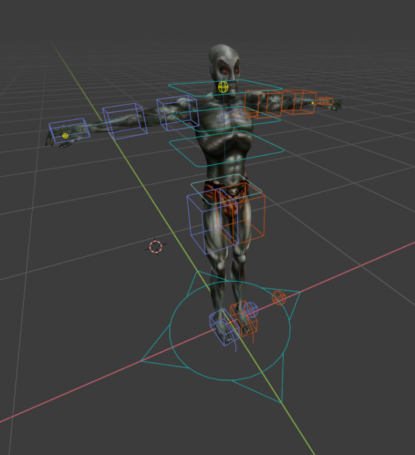

## Creating an NPC Animation

1. Open `Rig.blend` in Blender. This file provides a pre-configured rigging for easily making animation, which can then be exported for use in Morrowind.
2. After opening the blend file, you should see a dunmer with "widgets" surrounding his body.

3. Blender will often start you in `Object mode`. Click on any of the widgets and then switch to `Pose mode`.
4. In `Pose mode`, attempt to rotate or move some of the boxes. You should see the changes reflecting in the position of the dunmer.

> The main benefit of this rig is that it can toggle between inverse kinematics and forward kinematics. FK mode is the one it's on by default, where bones are a heirarcy of parent:child and when you move a parent it will move the whole children chain.

5. To toggle to IK (inverse kinematics) mode, press `[N]` to open the window side panel, then go to `Tools->Rig Main Properties`.

> If you do not have `Rig Main Properties`, make sure the `Rig Tools` plugin is enabled.

6. Then, select one of the hand or feet widgets and press the button `Snap IK-FK` to enable IK. Attempt to move or rotate the widget again to understand the difference in behaviour. Clicking the button again will return to FK.

7. Change the position as desired, then press `[A]` to select all widgets. Press `[I]` to create a keyframe. Select `Location + Rotation`. This will generate a keyframe in the graph editor.

> If you don't see the graph editor, try switching to the Animation environment in Blender.

> Make sure to select all widgets when creating a key frame, or you'll lose that part of your animation.

8. You can manually move the current frame in the graph editor to another frame, change the positioning, and then create a new keyframe at that frame. Press `[Space]` to play the animation between your two key frames. Repeat this as many times as needed to create your animation.

9. Press `[CTRL] + [TAB]` to toggle between the animation timeline / graph in the graph editor.

10. Save your blend file as a new file, such as `ExampleAnimation.blend`
