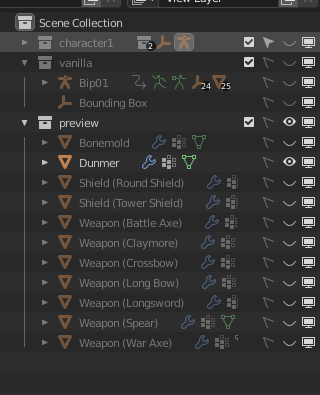
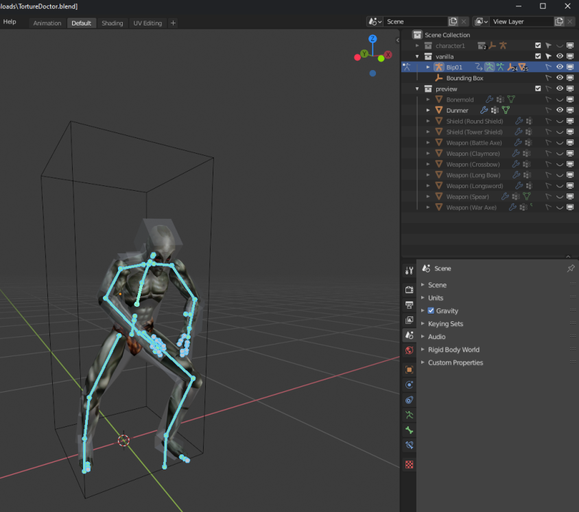
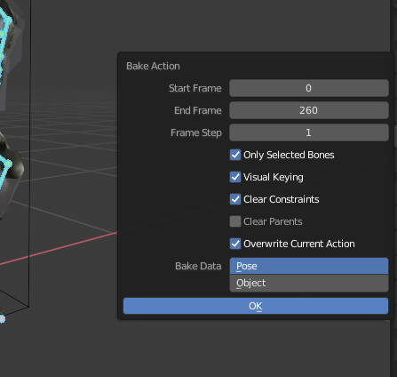
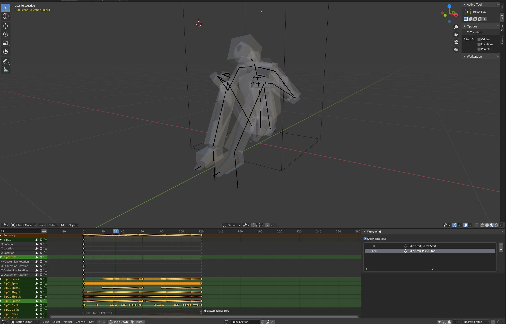

## Exporting an NPC Animation

Once you are satisfied with the animation, it must be converted to a Morrowind-friendly format and exported.

1. Exporting the animation requires making permanent changes to the blend file. Save your blend file as a new one, such as `ExampleAnimation_Baked.blend`.

2. To export the animation, we have to bake the current animations. Currently, the animations created only animate the widgets, which Morrowind does not understand. So, we have to bake all of the bones real positions into keyframes, which Morrowind can understand. First, we have to modify the scene collection. `[SHIFT] + [CLICK]` the "eye" next to `character1` in the Scene Collection window to hide the widgets from view.

3. Then, `[SHIFT] + [CLICK]` the "eye" and "pointer" next to `vanilla` to show the vanilla bones and make them selectable.

> To hide the dummer, click the eye next to `Dunmer` in the `preview` area of the Scene Collection.

4. Select a vanilla bone in the Object window, then enter `Pose mode`. Press `[A]` to select all bones. You _MUST_ select all bones or the next step will not work!

5. Press `[F3]` to open the command search. Search for `Bake Action...` and click it. In the `Bake Action` window, enable all checkbox options except for `Clear Parents`. Press `Ok`.

6. The graph editor should now contain a lot of yellow dots, representing the baked animation data. Try to play the animation. It should play as normal.

7. If you have not hidden the dunmer yet, do so now. `[SHIFT + CLICK]` the "eye" next to the dunmer in the Scene Collection.

8. If needed, we must setup keyframe text data so Morrowind knows what to do with each part of the animation. You can find a full list of text keys in the section `Animation Text Keys`. To do this, click in the graph editor panel, switch to the action editor view (click graph editor dropdown or `[SHIFT] + [TAB]`), and press `[N]` to open the side menu. From there, you can add text entries for each set of frames in your animation. For general animations, `Idle9` is the standard text key.

> If pressing `[N]` in the graph editor does not open the Morrowind sidebar, you probably have not baked your animations yet or are not in the action editor view.

> A full list of text keys can be found in the section, `Animation Text Keys`, as well as more information about entering text keys.

9. Export the animation. Go to `File -> Export -> Morrowind`. Enable options `Export Animation` and `Extract Keyframe data`. The export will generate 3 files. All 3 are required by Morrowind.

### Usage Notes

- The animation files can be previewed in NifSkope by opening the export file which _does not_ start with `x`. NifSkope should automatically play the animation track.
- The animation files can be used in the CS by assignined the export file which _does not_ start with `x` to an NPC, and then setting their AI appropriately if needed. If you used `idle9` as the text key, set that field to 100% chance in the AI window of the CS for it to run in a loop.

### Optimizations

- When baking animations, a key is generated for each frame, which is often more than needed. This can lead to bloated files. You can remove these extra keys using key decimation. In the graph editor, while in Pose mode, select all keyframes and click `Key->Decimate (Allowed Change)` and then in the operator popup customize the Error Margin to some value like 0.001 or higher. Only changes between keyframes with delta > 0.001 will be kept, potentially reducing file size by a lot. Test different margins, like 0.1, 0.5 or 1. _Note:_ This is reducing file size by reducing detail. Make sure the animation still plays as expected before completing the decimation. Try different margins and choose what works best for your animation.
